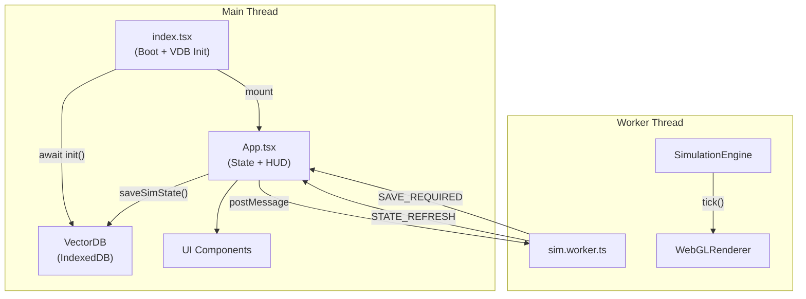
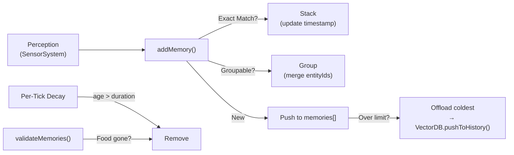
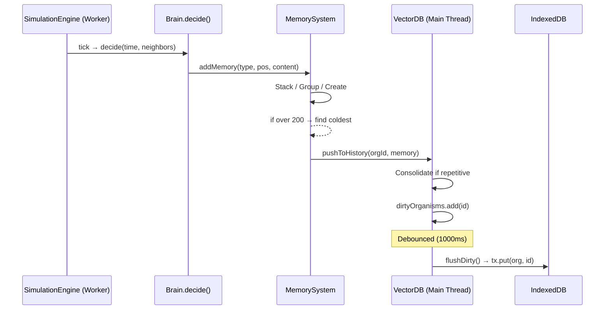
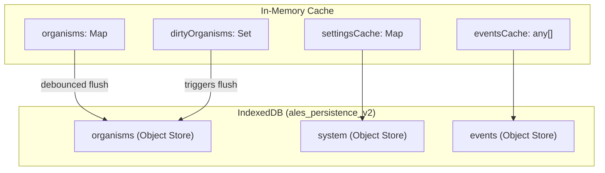

# ALES — Technical Blueprint Document (TBD)
### Autonomous Life Evolution Simulator
> Version: 2.0 | Updated: 2026-02-23

---

## Table of Contents
1. [Architecture Overview](#1-architecture-overview)
2. [Type System](#2-type-system)
3. [Cognitive & Memory Systems](#3-cognitive--memory-systems)
4. [Core Simulation Engine](#4-core-simulation-engine)
5. [Entity Systems](#5-entity-systems)
6. [Evolution & Genetics](#6-evolution--genetics)
7. [Data Layer (VectorDB)](#7-data-layer-vectordb)
8. [Rendering Pipeline](#8-rendering-pipeline)
9. [Worker Architecture](#9-worker-architecture)
10. [UI / HUD Components](#10-ui--hud-components)
11. [Constants & Calibration](#11-constants--calibration)
12. [File Manifest](#12-file-manifest)

---

## 1. Architecture Overview

ALES is a browser-based real-time life simulator built with **React 19**, **TypeScript**, and **Vite**. Rendering is done via a custom **WebGL** pipeline running inside a **Web Worker** (OffscreenCanvas). Persistence is handled by an atomic **IndexedDB** layer (`VectorDB`).



### Data Flow (per frame)
1. `sim.worker.ts` calls `engine.update()` → physics, AI decisions, births, deaths.
2. Every 10 frames: Worker posts `STATE_REFRESH` with sampled data to main thread.
3. Every 600 frames: Worker posts `SAVE_REQUIRED` with full state → main thread calls `VectorDB.saveSimState()`.
4. Main thread renders React HUD overlay; the Worker renders the WebGL canvas independently.

---

## 2. Type System

**File:** [`types.ts`](file:///c:/AIDev/AiDev_LLM/autonomous-life-evolution-simulator/types.ts) (141 lines)

| Type | Purpose | Key Fields |
|---|---|---|
| `Vector2` | 2D position/velocity | `x`, `y` |
| `AllelePair` | Single gene locus | `v1`, `v2` (values), `d1`, `d2` (dominance) |
| `TraitName` | Union of 8 heritable traits | `speed`, `size`, `metabolism`, `sight_range`, `sight_fov`, `lifespan`, `audible_range`, `communicating_range` |
| `Genome` | Full DNA | `traits: Record<TraitName, AllelePair>` |
| `EntityStats` | Phenotype (expressed traits) | Same 8 fields as numbers |
| `Memory` | Single cognitive record | `id`, `type`, `position`, `timestamp`, `duration`, `content`, `count`, `entityIds`, `isFamiliar` |
| `OrganismData` | Full organism state | ~27 fields: position, energy, genome, memories, lineage, naming, etc. |
| `FloraGenome` | Plant genetics | 4 trait categories: `structure`, `vitality`, `morphology`, `ecology` |
| `FloraData` | Full plant state | `growthState`, `energyValue`, `complexity`, `biome`, genome |
| `SimulationState` | Global sim state | `organisms[]`, `Flora[]`, `time/day/hour/season/cycle`, `config`, `events[]`, `apexCandidates[]`, `seed` |
| `SimConfig` | User-tunable params | `initialPopulation`, `initialEnergy`, `traitRanges` |
| `SimEvent` | Log entry | `type` (BIRTH/DEATH/MILESTONE), `message`, `position`, `entityId` |

---

## 3. Cognitive & Memory Systems

> **Directory:** `src/entities/Fauna/Cognition/`

This is the most architecturally complex subsystem. It implements a biologically-inspired perception → decision → memory pipeline.

### 3.1 Perception Pipeline (`SensorSystem.ts`)

**Class:** `SensorSystem` — Static scanner that produces a `SensoryInput` object each tick.

**Sensor Modalities:**
| Modality | Shape | Range Source | Touch Bypass |
|---|---|---|---|
| **Vision** | Cone (heading + FOV) | `sight_range` (meters) | Yes (`size * 0.8` px) |
| **Hearing** | 360° sphere | `audible_range` (meters) | — |
| **Communication** | 360° sphere | `communicating_range` (meters) | — |

**Output Interface:**
```typescript
interface SensoryInput {
    visibleFlora: FloraData[];
    visibleFauna: OrganismData[];
    audibleFauna: OrganismData[];
    communicatingFauna: OrganismData[];
}
```

**Implementation Notes:**
- Flora and Fauna are scanned separately. Flora uses vision cone only.
- Touch bypass ensures entities directly adjacent are always perceived regardless of heading.
- All distance comparisons convert between pixels and meters via `UNIT_UTILS`.

### 3.2 Decision Engine (`Brain.ts`)

**Class:** `Brain` — Instantiated per-organism; owns a `MemorySystem`.

**The `decide()` Method (246 lines):**
This is the organism's central nervous system. Each tick, it:

1. **Senses** — Calls `SensorSystem.scan()` to build a `SensoryInput`.
2. **Validates Memories** — Calls `MemorySystem.validateMemories()` to forget stale food locations.
3. **Creates Memories** — Calls `MemorySystem.addMemory()` for each perceived entity/food.
4. **Prioritizes Needs** — Energy-based decision tree:
   - **Critical Energy** → Seek nearest food (from memory or perception).
   - **Low Energy** → Seek food with wider search.
   - **Mating Ready** → Seek compatible partner (energy > threshold, opposite sex proximity).
   - **Idle** → Wander randomly.
5. **Executes Behavior** — Returns a `Vector2` steering force to `Fauna.applySteering()`.

**Decision Priority (descending):**
```
Starvation → Eat → Mate → Explore → Wander
```

### 3.3 Memory System (`MemorySystem.ts`)

**Class:** `MemorySystem` — Manages per-organism short-term and long-term memory.

#### Memory Lifecycle


#### `addMemory()` — The Core Logic (109 lines)

| Step | Logic | Purpose |
|---|---|---|
| **1. Constants** | `THREE_HOURS = 3 * FRAMES_PER_HOUR` | Temporal grouping window |
| **2. Target ID** | Extract `data?.id` | Unique entity matching |
| **3. Stacking** | Match by entity ID, grouped IDs, or content+proximity (<8px) | Prevent duplicate memories |
| **4. Grouping** | If same `type` within 3 hours AND `type === 'Fauna'`, merge IDs with spatial falloff probability | Group nearby sightings (e.g., "3 entities encountered") |
| **5. Create New** | Push `Memory` with random ID, duration = `FRAMES_PER_DAY * DAYS_TO_REMEMBER` | Fresh memory record |
| **6. Overflow** | If `memories.length > TEMPORARY_MEMORY_LIMIT (200)`, find coldest (low count, not familiar), offload to `VectorDB.pushToHistory()`, then splice | Short-term → Long-term relay |

**Spatial Grouping Formula:**
```
groupProbability = 1.0 - sqrt(distNormalized)  // Concave falloff
```
Where `distNormalized = dist / visionRange`. Closer entities are more likely grouped.

#### `validateMemories()` — Memory Integrity
- Filters `Food`/`Flora` memories by checking if the remembered position still has visible flora within 12px.
- If the organism can see the location but the food is gone → memory is deleted.

#### `getBestFoodLocation()`
- Returns the first `Food` or `Flora` memory found (FIFO priority).

### 3.4 Memory Constants

| Constant | Value | Purpose |
|---|---|---|
| `DAYS_TO_REMEMBER` | 2 | Memory duration in sim-days |
| `TEMPORARY_MEMORY_LIMIT` | 200 | Max short-term memories per organism |
| `PERSISTENT_MEMORY_LIMIT` | 200 | Max memories saved to IndexedDB per organism |
| `HISTORICAL_MEMORY_LIMIT` | 100 | Max family tree / graveyard memories |

### 3.5 Ideographic Language (`SymbolMap.ts`)

A symbolic dictionary mapping memory types and content keywords to emoji-based ideograms.

**Token Categories:**
| Category | Tokens |
|---|---|
| **Process** | 🌀 Perception, 👁️ Vision, 👤 Entity, 🔆 Recognition, ⚛️ Concept, 🫂 Familiarity, 👥 Group |
| **Types** | 🌿 Flora, 🍏 Food, 👤 Fauna, ❤️ Mate, ⚠️ Threat, 📡 SectorScan, 🧠 Memory, 🗺️ Location |
| **Keywords** | 🍎 Ate/Consumed, 🤝 Met, 👁️ Saw, 🗣️ Shared, 💀 Danger, 🏠 Home, 💧 Water |

**`getSyntax()` Output Examples:**
- Familiar entity: `[🌀👁️👤] 🔆 {⚛️🫂}`
- Group sighting: `[🌀👁️🫂👥]`
- Food discovery: `[🌀👁️🌿]🔆{⚛️🍏🗺️}`

### 3.6 Data Flow: Short-Term → Long-Term



---

## 4. Core Simulation Engine

**File:** [`SimulationEngine.ts`](file:///c:/AIDev/AiDev_LLM/autonomous-life-evolution-simulator/src/core/SimulationEngine.ts) (467 lines)

### 4.1 Constructor & Initialization
- Accepts `width`, `height`, optional `initialState`.
- Generates procedural terrain via `TerrainManager` with seeded `Noise`.
- Spawns initial organisms (20) and flora (90) if no saved state.
- Validates all organism data integrity (genomes, traits, memories, headings).

### 4.2 `update()` — The Main Tick (204 lines)
Executed every frame (~60fps). Steps:

| Phase | Description |
|---|---|
| **Time** | Increment `time`, calculate `hour`, `day`, `season`, `cycle` |
| **Spatial Grids** | Rebuild `orgGrid` and `floraGrid` (SpatialGrid) for O(1) neighbor lookups |
| **Fauna Loop** | For each organism: query neighbors → `Brain.decide()` → `Fauna.update()` → death check |
| **Flora Loop** | For each flora: `Flora.update()` → expiry check → cluster spreading |
| **Flora Spawning** | Bloom logic based on season factor + density |
| **Apex Selection** | Sort organisms by generation (descending) → top 5 as `apexCandidates` |
| **Population Stats** | Calculate `meanAge`, `speed95th` for title assignment |

### 4.3 Birth & Death

**Birth (`spawnOrganism`):**
1. `ReproductionEngine.processBirth()` → genetic recombination + mutation.
2. `LinguisticEngine.constructFullLinguisticProfile()` → name inheritance.
3. Energy deducted from parents, transferred to child (with metabolic efficiency loss).
4. Organism registered in `VectorDB.addHistory()`.

**Death:**
- Energy ≤ 0 or age > lifespan.
- Logged as `DEATH` event.
- Posted to main thread via `REGISTRY_DECEASED` message.

### 4.4 Supporting Core Files

| File | Purpose |
|---|---|
| [`SpatialGrid.ts`](file:///c:/AIDev/AiDev_LLM/autonomous-life-evolution-simulator/src/core/SpatialGrid.ts) | O(1) neighbor queries via cell-based spatial hashing |
| [`TerrainManager.ts`](file:///c:/AIDev/AiDev_LLM/autonomous-life-evolution-simulator/src/core/TerrainManager.ts) | Procedural terrain with biomes (GRASS, ARID, CLIFF, WATER), impassability checks |
| [`Noise.ts`](file:///c:/AIDev/AiDev_LLM/autonomous-life-evolution-simulator/src/core/Noise.ts) | Simplex noise for terrain generation |
| [`VectorMath.ts`](file:///c:/AIDev/AiDev_LLM/autonomous-life-evolution-simulator/src/core/VectorMath.ts) | 2D vector utilities: `add`, `sub`, `dist`, `normalize`, `dot`, `limit` |

---

## 5. Entity Systems

### 5.1 Fauna (`src/entities/Fauna/`)

| File | Class/Module | Responsibility |
|---|---|---|
| [`Base.ts`](file:///c:/AIDev/AiDev_LLM/autonomous-life-evolution-simulator/src/entities/Fauna/Base.ts) | `Fauna` | Per-tick update: metabolism → physics → memory decay → movement. `applySteering()` for organic turns. `calculateBending()` for visual curvature. |
| [`Metabolism.ts`](file:///c:/AIDev/AiDev_LLM/autonomous-life-evolution-simulator/src/entities/Fauna/Metabolism.ts) | `Metabolism` | Energy loss formula: `(1/metabolism) * speed * size / FPS`. Lower metabolism efficiency = higher burn rate. |
| [`ReproductionEngine.ts`](file:///c:/AIDev/AiDev_LLM/autonomous-life-evolution-simulator/src/entities/Fauna/ReproductionEngine.ts) | `ReproductionEngine` | Birth orchestration: inheritance → mutation → energy math. Asexual reproduction **disabled**. Trait surcharge based on child stats. |
| [`LinguisticEngine.ts`](file:///c:/AIDev/AiDev_LLM/autonomous-life-evolution-simulator/src/entities/Fauna/LinguisticEngine.ts) | `LinguisticEngine` | CVC phonetic naming, Markov-weighted syllables, surname inheritance, Roman numeral suffixing, nobility/titles. |
| `Cognition/` | See §3 | Brain, MemorySystem, SensorSystem, SymbolMap |

**Species Profile (`SpeciesA/`):**

| File | Purpose |
|---|---|
| [`DNAProfile.ts`](file:///c:/AIDev/AiDev_LLM/autonomous-life-evolution-simulator/src/entities/Fauna/SpeciesA/DNAProfile.ts) | Trait ranges (speed: 2.8–3.2 m/s, size: 75–85 cm, lifespan: 20–30 days, etc.), reproduction threshold (4500 energy) |
| [`Logic.ts`](file:///c:/AIDev/AiDev_LLM/autonomous-life-evolution-simulator/src/entities/Fauna/SpeciesA/Logic.ts) | Species-specific behavior overrides |

### 5.2 Flora (`src/entities/Flora/`)

| File | Class | Responsibility |
|---|---|---|
| [`Base.ts`](file:///c:/AIDev/AiDev_LLM/autonomous-life-evolution-simulator/src/entities/Flora/Base.ts) | `Flora` | DNA-driven plant creation (ignored legacy energy args), 4-trait genome (`structure`, `vitality`, `morphology`, `ecology`), growth → maturity → expiry lifecycle, mass interlinking |
| `Fern/DNAProfile.ts` | Config | Trait ranges: growth speed, complexity, stem thickness, leaf size, persistence, hue, clump radius |
| `Fern/Logic.ts` | `FernLogic` | Per-tick growth update using terrain biome modifiers |

**Flora Growth Formula:**
```
mass = stem * leaf * (complexity / 6.0)
growthSpeed = geneticRatio / (1 + mass * MASS_PENALTY_FACTOR)
framesToMaturity = FRAMES_PER_SEASON / growthSpeed
```

---

## 6. Evolution & Genetics

**Directory:** `src/evolution/`

### 6.1 GeneticsEngine (`GeneticsEngine.ts`)

| Function | Description |
|---|---|
| `createRandomGenome()` | Generates homozygous initial genome from trait ranges |
| `express()` | Dominance-based expression: `d1 >= d2 ? v1 : v2` |
| `mutate()` | Gaussian mutation with `MUTATION_STRENGTH = 0.12` × range span, clamped to physical limits |
| `recombine()` | Random allele selection from each parent (50/50 per locus) |
| `ensureIntegrity()` | Fills missing traits with random values (handles schema evolution) |

**Physical Limits (hard caps, not evolvable beyond):**
| Trait | Min | Max |
|---|---|---|
| Speed | 0.1 m/s | 5.0 m/s |
| Size | 2 cm | 150 cm |
| Metabolism | 0.1 | 5.0 |
| Sight Range | 2 m | 100 m |
| Sight FOV | 0.1 rad | 2π rad |
| Lifespan | 100 frames | 1000 days |

### 6.2 TraitManifest (`TraitManifest.ts`)
Static metadata for UI display: `min`, `max`, `description` per trait.

### 6.3 SpeciesRegistry (`SpeciesRegistry.ts`)
Placeholder for future multi-species support.

---

## 7. Data Layer (VectorDB)

**File:** [`VectorDB.ts`](file:///c:/AIDev/AiDev_LLM/autonomous-life-evolution-simulator/src/data/VectorDB.ts) (~420 lines)

### 7.1 Architecture: Atomic Write-Behind Cache



### 7.2 Object Stores

| Store | Key | Content |
|---|---|---|
| `organisms` | Organism ID | Tokenized individual organism record |
| `system` | `ales_sim_state` / `ales_settings` | Global sim state, UI preferences |
| `events` | Integer index | Tokenized event log entries |

### 7.3 Key Methods

| Method | Description |
|---|---|
| `init()` | Hydrates all caches from IDB in parallel. Must be awaited before any render. |
| `saveSimState(state)` | Strips derived data, tokenizes, writes to `system` store. Events written to `events` store. |
| `loadSimState()` | Reads from `system` store, detokenizes, reattaches events. |
| `syncLiving(organisms[])` | Updates energy/age/matingCount for living organisms. Marks dirty. |
| `pushToHistory(id, memory)` | **Consolidation logic**: merges sequential "Energy" memories into multiplier entries. |
| `addHistory(org)` | Registers a new organism in the cache and indices. |
| `markDeceased(id)` | Sets `isAlive = false` on the record. |
| `flushDirty()` | Atomic batch write: iterates `dirtyOrganisms`, puts tokenized records in a single transaction. |
| `hardReset()` | Clears all 3 IDB stores + in-memory caches. |

### 7.4 Tokenization
Compact key mapping to reduce IndexedDB payload size:
```
"organisms" → "o", "position" → "p", "velocity" → "v", "genome" → "g", ...
```
Bidirectional via `TOKEN_MAP` / `REVERSE_TOKEN_MAP`.

### 7.5 Memory Consolidation
In `pushToHistory()`:
- If the last memory AND the new memory both contain `"Energy"` → increment a counter: `"Harvested Nx Energy"`.
- Otherwise, push as a new entry (deduped by `memory.id`).

### 7.6 Pruning Policy
**Disabled.** No automatic pruning occurs. All organism records persist indefinitely until a manual `hardReset()` via the UI reset button. This is by design to preserve complete lineage history.

---

## 8. Rendering Pipeline

**Directory:** `src/rendering/`

| File | Size | Purpose |
|---|---|---|
| [`WebGLRenderer.ts`](file:///c:/AIDev/AiDev_LLM/autonomous-life-evolution-simulator/src/rendering/WebGLRenderer.ts) | 39KB | Full WebGL2 renderer: terrain texture, instanced organism/flora rendering, selection highlights, vision/hearing overlays, grid |
| [`CreatureShaders.glsl`](file:///c:/AIDev/AiDev_LLM/autonomous-life-evolution-simulator/src/rendering/CreatureShaders.glsl) | 10KB | GLSL vertex + fragment shaders: SDF-based larval bodies with bending, bioluminescent VFX, size-based color modulation |
| [`AppearanceMapper.ts`](file:///c:/AIDev/AiDev_LLM/autonomous-life-evolution-simulator/src/rendering/AppearanceMapper.ts) | ~1KB | Maps organism traits to visual properties |
| [`ScaleUtils.ts`](file:///c:/AIDev/AiDev_LLM/autonomous-life-evolution-simulator/src/rendering/ScaleUtils.ts) | ~1KB | DPR-aware scaling utilities |

**Rendering runs in the Worker thread** via `OffscreenCanvas`, decoupled from React.

---

## 9. Worker Architecture

**File:** [`sim.worker.ts`](file:///c:/AIDev/AiDev_LLM/autonomous-life-evolution-simulator/src/worker/sim.worker.ts) (186 lines)

### 9.1 Message Protocol (Main → Worker)

| Message | Payload | Action |
|---|---|---|
| `INIT` | `{ canvas, worldSize, initialState, resolution }` | Create engine + renderer, start tick loop |
| `UPDATE_CAMERA` | Camera params | Update zoom, offset, selection, overlays |
| `SET_PAUSED` | `boolean` | Pause/resume simulation |
| `RESIZE` | `{ width, height }` | Update canvas and resolution |
| `HIT_TEST` | `{ x, y }` | Find organism/flora at world coordinates |
| `UPDATE_CONFIG` | `SimConfig` | Hot-update simulation parameters |
| `RESET` | — | Hard reset engine |

### 9.2 Message Protocol (Worker → Main)

| Message | Frequency | Payload |
|---|---|---|
| `STATE_REFRESH` | Every 10 frames | Time, population counts, events, apex candidates, selected/hovered entity |
| `SAVE_REQUIRED` | Every 600 frames | Full `SimulationState` |
| `HIT_RESULT` | On demand | Entity ID or null |
| `CAMERA_SYNC` | When following | Updated camera offset |
| `REGISTRY_LOG` | On birth | New `OrganismData` |
| `REGISTRY_DECEASED` | On death | Organism ID |

### 9.3 Camera Follow Logic
When `isFollowing` + `selectedId` is set:
```
targetX = (viewWidth/2) - (organism.x * zoom)
targetY = (viewHeight/2) - (organism.y * zoom)
offset += (target - offset) * 0.1  // Smooth lerp
```

---

## 10. UI / HUD Components

**Directory:** `src/components/`

| Component | File Size | Purpose |
|---|---|---|
| `SimulationCanvas.tsx` | 7KB | OffscreenCanvas host, mouse/wheel/click event translation to world coords, hit testing |
| `EntityInspector.tsx` | 32KB | Detailed organism/flora panel: stats, genome, memories, lineage, family tree. Draggable. |
| `VectorDBVisualizer.tsx` | 23KB | Database inspector: organism grid, event log, settings, memory counts. Toggle via UI button. |
| `ChronosHUD.tsx` | 8KB | Time display: day/hour, season, cycle, population/flora counts, event log |
| `ApexRegistry.tsx` | 11KB | Top-5 organism leaderboard, sortable by lineage/energy/age, double-click to zoom |
| `SettingsModal.tsx` | 6KB | Simulation config editor: population, energy, trait ranges |
| `Tooltip.tsx` | 5KB | Reusable hover tooltip with title + content |
| `DebugDropdown.tsx` | 6KB | Debug overlays: vision cones, hearing ranges, communication, grid |
| `NotificationPanel.tsx` | 3KB | Toast notification system |
| `ResetModal.tsx` | 2KB | Confirmation dialog for hard reset |

**Layering Order (bottom → top):**
Canvas → ChronosHUD → ApexRegistry → EntityInspector → Modals → VectorDBVisualizer → Notifications

---

## 11. Constants & Calibration

**File:** [`Constants.ts`](file:///c:/AIDev/AiDev_LLM/autonomous-life-evolution-simulator/src/core/Constants.ts)

### Time System
| Real Time | Sim Time | Frames |
|---|---|---|
| 1.25 sec | 1 hour | 75 |
| 30 sec | 1 day | 1,800 |
| 10 min | 1 season (20 days) | 36,000 |
| 40 min | 1 cycle (4 seasons) | 144,000 |

### World Space
- **World Size:** 100m × 100m
- **Pixels Per Meter:** 20 (2000px logical viewport)
- **Grid Resolution:** 100 cells

### Season Themes
| Season | Name | Color | Effect |
|---|---|---|---|
| Spring | Aeon-Vahr | #4ade80 | bloomFactor: 1.2 |
| Summer | Sol-Kyra | #fbbf24 | heatFactor: 1.5 |
| Autumn | Vun-Droma | #f97316 | decayFactor: 1.1 |
| Winter | Kryos-Nihr | #22d3ee | coldFactor: 0.8 |

### Population Defaults
| Parameter | Value |
|---|---|
| Initial Organisms | 20 |
| Initial Flora | 90 |
| Flora Spawn Rate | 0.10 |
| Birth Cost | 15,000 energy |
| Initial Energy | 4,500–5,000 |
| Max Energy | 30,000 |

---

## 12. File Manifest

```
src/
├── App.tsx                          # 18KB  Main app + state management
├── index.tsx                        # 3KB   Boot sequence + ErrorBoundary
├── firebase.ts                      # 1KB   Firebase config (unused?)
├── TBD.md                           # THIS FILE
│
├── core/
│   ├── Constants.ts                 # 4KB   All calibration constants
│   ├── SimulationEngine.ts          # 20KB  Main simulation loop
│   ├── SpatialGrid.ts               # 2KB   Cell-based spatial hashing
│   ├── TerrainManager.ts            # 3KB   Procedural biome terrain
│   ├── Noise.ts                     # 4KB   Simplex noise
│   └── VectorMath.ts                # 2KB   2D vector math
│
├── data/
│   └── VectorDB.ts                  # 16KB  IndexedDB persistence layer
│
├── entities/
│   ├── Fauna/
│   │   ├── Base.ts                  # 4KB   Organism update loop
│   │   ├── Metabolism.ts            # 1KB   Energy loss formula
│   │   ├── ReproductionEngine.ts    # 3KB   Birth orchestration
│   │   ├── LinguisticEngine.ts      # 6KB   Naming & titles
│   │   ├── Cognition/
│   │   │   ├── Brain.ts             # 12KB  Decision engine
│   │   │   ├── MemorySystem.ts      # 6KB   Memory management
│   │   │   ├── SensorSystem.ts      # 3KB   Perception pipeline
│   │   │   ├── SymbolMap.ts         # 3KB   Ideographic language
│   │   │   └── memory_readme.md     # 3KB   Memory architecture docs
│   │   └── SpeciesA/
│   │       ├── DNAProfile.ts        # 1KB   Species trait ranges
│   │       └── Logic.ts             # 2KB   Species behavior
│   └── Flora/
│       ├── Base.ts                  # 5KB   Plant lifecycle
│       └── Fern/
│           ├── DNAProfile.ts        # 2KB   Plant trait ranges
│           └── Logic.ts             # 1KB   Growth logic
│
├── evolution/
│   ├── GeneticsEngine.ts            # 5KB   Genome operations
│   ├── TraitManifest.ts             # 1KB   Trait metadata
│   └── SpeciesRegistry.ts           # 1KB   Multi-species placeholder
│
├── rendering/
│   ├── WebGLRenderer.ts             # 40KB  WebGL2 renderer
│   ├── CreatureShaders.glsl         # 10KB  GLSL shaders
│   ├── AppearanceMapper.ts          # 1KB   Trait → visual mapping
│   └── ScaleUtils.ts                # 1KB   DPR utilities
│
├── components/
│   ├── SimulationCanvas.tsx         # 7KB   Canvas host + input
│   ├── EntityInspector.tsx          # 32KB  Entity detail panel
│   ├── VectorDBVisualizer.tsx       # 23KB  DB inspector
│   ├── ChronosHUD.tsx               # 8KB   Time/pop display
│   ├── ApexRegistry.tsx             # 11KB  Top organisms
│   ├── SettingsModal.tsx            # 6KB   Config editor
│   ├── Tooltip.tsx                  # 5KB   Hover tooltips
│   ├── DebugDropdown.tsx            # 6KB   Debug overlays
│   ├── NotificationPanel.tsx        # 3KB   Toast notifications
│   └── ResetModal.tsx               # 2KB   Reset confirmation
│
├── worker/
│   └── sim.worker.ts                # 7KB   Web Worker bridge
│
└── styles/
    └── index.css                    # Global styles
```
